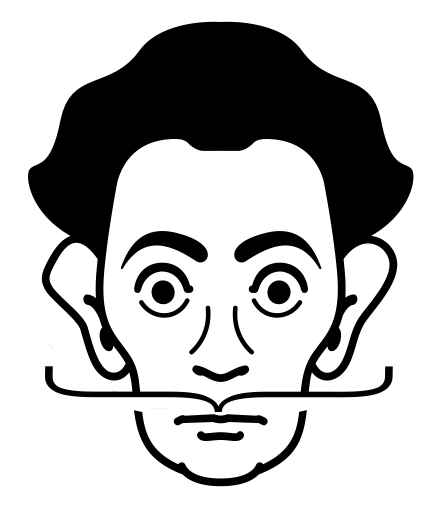

# Surrealist
[](https://travis-ci.org/nesaulov/surrealist)
[](https://coveralls.io/github/nesaulov/surrealist?branch=master)
[](http://inch-ci.org/github/nesaulov/surrealist)
[](https://rubygems.org/gems/surrealist)


 
A gem that provides DSL for serialization of plain old Ruby objects to JSON in a declarative style
by defining a `json_schema`. It also provides a trivial type checking in the runtime before serialization.
[Yard documentation](http://www.rubydoc.info/github/nesaulov/surrealist/master)


## Motivation
A typical use case for this gem could be, for example, serializing a (decorated) object outside
of the view context. The schema is described through a hash, so you can build the structure
of serialized object independently of its methods and attributes, while also having possibility
to serialize nested objects and structures. [Introductory blogpost.](https://medium.com/@billikota/introducing-surrealist-a-gem-to-serialize-ruby-objects-according-to-a-defined-schema-6ca7e550628d)

* [Installation](#installation)
* [Usage](#usage)
  * [Simple example](#simple-example)
  * [Nested structures](#nested-structures)
  * [Nested objects](#nested-objects)
  * [Delegating Surrealization](#delegating-surrealization)
  * [Usage with Dry::Types](#usage-with-drytypes)
  * [Build schema](#build-schema)
  * [Camelization](#camelization)
  * [Include root](#include-root)
  * [Include namespaces](#include-namespaces)
  * [Collection Surrealization](#collection-surrealization)
  * [Bool and Any](#bool-and-any)
  * [Type errors](#type-errors)
  * [Undefined methods in schema](#undefined-methods-in-schema)
  * [Other notes](#other-notes)
* [Roadmap](#roadmap)  
* [Contributing](#contributing)
* [Credits](#credits)
* [License](#license)


## Installation
Add this line to your application's Gemfile:

``` ruby
gem 'surrealist'
```

And then execute:

    $ bundle

Or install it yourself as:

    $ gem install surrealist


## Usage
Schema should be defined with a block that contains a hash. Every key of the schema should be
either a name of a method of the surrealizable object (or it's parents/mixins),
or - in case you want to build json structure independently from object's structure - a symbol.
Every value of the hash should be a constant that represents a Ruby class,
that will be used for type-checks.

### Simple example
* Include Surrealist in your class.
* Define a schema with methods that need to be serialized.

``` ruby
class Person
  include Surrealist
 
  json_schema do
    { name: String, age: Integer }
  end
 
  def name
    'John Doe'
  end
 
  def age
    42
  end
end
```

* Surrealize it.

``` ruby
Person.new.surrealize
# => '{ "name": "John Doe", "age": 42 }'
```

### Nested structures

``` ruby
class Person
  include Surrealist
 
  json_schema do
    {
      foo: String,
      name: String,
      nested: {
        at: {
          any: Integer,
          level: Boolean,
        },
      },
    }
  end
  # ... method definitions
end
 
Person.find_by(email: 'example@email.com').surrealize
# => '{ "foo": "Some string", "name": "John Doe", "nested": { "at": { "any": 42, "level": true } } }'
```

### Nested objects
If you need to serialize nested objects and their attributes, you should
define a method that calls nested object:

``` ruby
class User
  include Surrealist
  
  json_schema do
    {
      name: String,
      credit_card: {
        number: Integer,
        cvv: Integer,
      },
    }
  end
 
  def name
    'John Doe'
  end
 
  def credit_card
    # Assuming that instance of a CreditCard has methods #number and #cvv defined
    CreditCard.find_by(holder: name)
  end
end

User.new.surrealize
# => '{ "name": "John Doe", "credit_card": { "number": 1234, "cvv": 322 } }'

```

### Delegating surrealization
You can share the `json_schema` between classes:
``` ruby
class Host
  include Surrealist
 
  json_schema do
    { name: String }
  end
 
  def name
    'Host'
  end
end

class Guest
  delegate_surrealization_to Host
 
  def name
    'Guest'
  end
end

Host.new.surrealize
# => '{ "name": "Host" }'
Guest.new.surrealize
# => '{ "name": "Guest" }'
```
Schema delegation works without inheritance as well, so if you wish you can
delegate surrealization not only to parent classes, but to any class. Please note that
in this case you have to `include Surrealist` in class that delegates schema as well.
``` ruby
class Potato
  include Surrealist
  delegate_surrealization_to Host
 
  def name
    'Potato'
  end
end

Potato.new.surrealize
# => '{ "name": "Potato" }'
```


### Usage with Dry::Types
You can use `Dry::Types` for type checking. Note that Surrealist does not ship
with dry-types by default, so you should do the [installation and configuration](http://dry-rb.org/gems/dry-types/)
by yourself. All built-in features of dry-types work, so if you use, say, `Types::Coercible::String`,
your data will be coerced if it is able to, otherwise you will get a TypeError.
Assuming that you have defined module called `Types`:

``` ruby
require 'dry-types'

class Car
  include Surrealist
 
  json_schema do
    {
      age:            Types::Coercible::Int,
      brand:          Types::Coercible::String,
      doors:          Types::Int.optional,
      horsepower:     Types::Strict::Int.constrained(gteq: 20),
      fuel_system:    Types::Any,
      previous_owner: Types::String,
    }
  end
 
  def age;
    '7'
  end
 
  def previous_owner;
    'John Doe'
  end
 
  def horsepower;
    140
  end
 
  def brand;
    'Toyota'
  end
 
  def doors; end
 
  def fuel_system;
    'Direct injection'
  end
end

Car.new.surrealize
# => '{ "age": 7, "brand": "Toyota", "doors": null, "horsepower": 140, "fuel_system": "Direct injection", "previous_owner": "John Doe" }'
```

### Build schema
If you don't need to dump the hash to json, you can use `#build_schema`
method on the instance. It calculates values and checks types, but returns
a hash instead of a JSON string. From the previous example:

``` ruby
Car.new.build_schema
# => { age: 7, brand: "Toyota", doors: nil, horsepower: 140, fuel_system: "Direct injection", previous_owner: "John Doe" }
```

### Camelization
If you need to have keys in camelBack, you can pass optional `camelize` argument
to `#surrealize or #build_schema`. From the previous example:

``` ruby
Car.new.surrealize(camelize: true)
# => '{ "age": 7, "brand": "Toyota", "doors": null, "horsepower": 140, "fuelSystem": "Direct injection", "previousOwner": "John Doe" }'
```

### Include root
If you want to wrap the resulting JSON into a root key, you can pass optional `include_root` argument
to `#surrealize` or `#build_schema`. The root key in this case will be taken from the class name of the
surrealizable object.
``` ruby
class Cat
  include Surrealist
 
  json_schema do
    { weight: String }
  end
 
  def weight
    '3 kilos'
  end
end
 
Cat.new.surrealize(include_root: true)
# => '{ "cat": { "weight": "3 kilos" } }'
```
With nested classes the last namespace will be taken as root key:
``` ruby
class Animal
  class Dog
    include Surrealist
 
    json_schema do
      { breed: String }
    end
 
    def breed
      'Collie'
    end
  end
end

Animal::Dog.new.surrealize(include_root: true)
# => '{ "dog": { "breed": "Collie" } }'
```

### Include namespaces
You can build wrap schema into a nested hash from namespaces of the object's class.
``` ruby
class BusinessSystem::Cashout::ReportSystem::Withdraws
  include Surrealist
 
  json_schema do
    { withdraws_amount: Integer }
  end
 
  def withdraws_amount
    34
  end
end
 
withdraws = BusinessSystem::Cashout::ReportSystem::Withdraws.new
 
withdraws.surrealize(include_namespaces: true)
# => '{ "business_system": { "cashout": { "report_system": { "withdraws": { "withdraws_amount": 34 } } } } }' 
```
By default all namespaces will be taken. If you want you can explicitly specify the level of nesting:
``` ruby
withdraws.surrealize(include_namespaces: true, namespaces_nesting_level: 2)
# => '{ "report_system": { "withdraws": { "withdraws_amount": 34 } } }'
```

### Collection Surrealization
Since 0.2.0 Surrealist has API for collection serialization. Example for ActiveRecord:
``` ruby
class User < ActiveRecord::Base
  include Surrealist
 
  json_schema do
    { name: String, age: Integer }
  end
end
 
users = User.all
# => [#<User:0x007fa1485de878 id: 1, name: "Nikita", age: 23>, #<User:0x007fa1485de5f8 id: 2, name: "Alessandro", age: 24>]
 
Surrealist.surrealize_collection(users)
# => '[{ "name": "Nikita", "age": 23 }, { "name": "Alessandro", "age": 24 }]'
```
You can find motivation behind introducing new API versus monkey-patching [here](https://alessandrominali.github.io/monkey_patching_real_example).  
`#surrealize_collection` works for all data structures that respond to `#each`. All ActiveRecord
features (like associations, inheritance etc) are supported and covered. Other ORMs should work without
issues as well, tests are in progress. All optional arguments (`camelize`, `include_root` etc) are also supported.

An additional and unique arguement is `raw` which is evalauted as a Boolean. If this option is truthy then the results will be an array of surrealized hashes (ie. NOT a JSON string).
```
Surrealist.surrealize_collection(users, raw: true)
# => [{ "name": "Nikita", "age": 23 }, { "name": "Alessandro", "age": 24 }]
```
Guides on where to use `#surrealize_collection` vs `#surrealize` for all ORMs are coming.

### Bool and Any
If you have a parameter that is of boolean type, or if you don't care about the type, you
can use `Bool` and `Any` respectively.

``` ruby
class User
  include Surrealist
 
  json_schema do
    {
      age: Any,
      admin: Bool,
    }
  end
end
```

### Type Errors
`Surrealist::InvalidTypeError` is thrown if types (and dry-types) mismatch.

``` ruby
class CreditCard
  include Surrealist
 
  json_schema do
    { number: Integer }
  end
 
  def number
    'string'  
  end
end

CreditCard.new.surrealize
# => Surrealist::InvalidTypeError: Wrong type for key `number`. Expected Integer, got String.
```

### Undefined methods in schema
`Surrealist::UndefinedMethodError` is thrown if a key defined in the schema does not have
a corresponding method defined in the object.

``` ruby
class Car
  include Surrealist
 
  json_schema do
    { weight: Integer }
  end
end

Car.new.surrealize
# => Surrealist::UndefinedMethodError: undefined method `weight' for #<Car:0x007f9bc1dc7fa8>. You have probably defined a key in the schema that doesn't have a corresponding method.
```

### Other notes
* nil values are allowed by default, so if you have, say, `age: String`, but the actual value is nil,
type check will be passed. If you want to be strict about `nil`s consider using `Dry::Types`.
* Surrealist [officially supports](https://travis-ci.org/nesaulov/surrealist) MRI Ruby 2.2+ but should be working on other platforms as well.

## Roadmap
Here is a list of features that are not implemented yet (contributions are welcome):
* [Collection serialization](https://github.com/nesaulov/surrealist/issues/12)

## Contributing
Bug reports and pull requests are welcome on GitHub at https://github.com/nesaulov/surrealist.
This project is intended to be a safe, welcoming space for collaboration, and contributors are expected
to adhere to the [Contributor Covenant](http://contributor-covenant.org) code of conduct.

## Credits
The icon was created by [Simon Child from Noun Project](https://thenounproject.com/term/salvador-dali/124566/) and is published under [Creative Commons License](https://creativecommons.org/licenses/by/3.0/us/)

## License
The gem is available as open source under the terms of the [MIT License](http://opensource.org/licenses/MIT).
